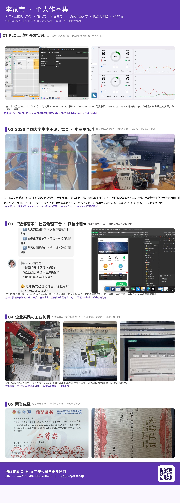

# 李家宝 · 作品集

嵌入式 / 软件开发方向（C / C++ / C#）求职作品集。涵盖嵌入式固件、工业上位机、跨端应用、微信小程序与多人游戏架构等项目实践。

## 项目一览

- **2026 电赛 · 小车平衡球**：TI MSPM0G3507 主控 + K230 视觉，YOLO 单类别小球目标检测（验证集 mAP@0.5 达 1.0，帧率约 28 FPS），另独立开发 Flutter BLE 蓝牙上位机
- **PLC 上位机实践（C# / S7.NetPlus / WPF）**：对接 S7-1500（PLCSIM Advanced 仿真），20+ 过程点位、100ms 周期轮询，WPF 实时画面与报警
- **近邻管家微信小程序**：技术负责人 / 核心开发，独立完成小程序主要功能的开发与迭代，社区互助平台，获挑战杯创业计划竞赛湖南省银奖、课外学术科技作品竞赛省二等奖
- **《深痕》多人游戏（Godot / C#）**：独立开发中，局域网 + 专用服务器双模式联机、服务端权威状态同步、mod 插件系统三类扩展点分离
- **全国大学生统计建模大赛湖南省三等奖**：Python 数据清洗 + K-means 聚类分析
- **华数机器人企业实践**：学校统一安排的多模块工程实践，获评"优秀学员"

## 开源代码

| 目录 | 内容 | 亮点 |
|---|---|---|
| [`code/supercar`](code/supercar/) | 电赛小车平衡球全套源码：MSPM0G3507 嵌入式 C 固件 + Flutter BLE 上位机 + 23 篇模块文档 | BSP / Drivers / Middlewares / App 四层架构，约 1.5 万行 C；自研 BLE 协议（XOR8 校验 / 心跳 / 断线重连）；PID 控制、Mahony 姿态解算 |
| [`code/godot-multiplayer-demo`](code/godot-multiplayer-demo/) | Godot 4 C# 多人联机框架 Demo | 服务端权威状态同步（NetworkManager）、专用服务器启动（Bootstrap）、mod 加载器（IMod / ModLoader / SampleMod）、房间与聊天系统 |
